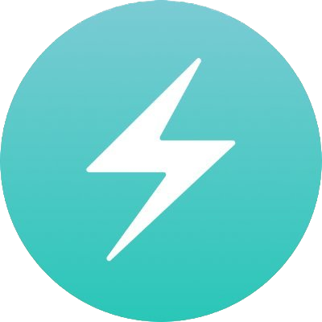
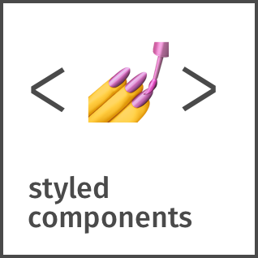
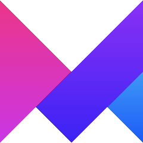
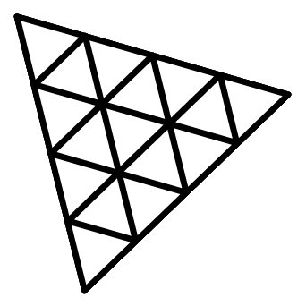
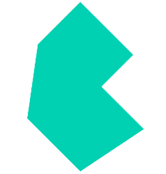

<h2 align="center">Koma Corporation</h2>

  

 
 

  <a href=https://codesandbox.io/u/Ivan-Corporation>
  
⇱
</a> 
<a href=mailto:hammer.99.ivan@gmail.com>
  
⇱
</a>
  <a href=https://www.linkedin.com/in/ivan-komar-313960237/>
  
⇱
</a>
 
  <a href=https://www.youtube.com/channel/UCWj8NJUnyji2xHHThU1TTsw>
  
⇱
</a>
  <a href=https://twitter.com/KomaHuman>
  
⇱
</a>

  <a href=https://www.t.me/KomarIvan>
  
⇱
</a> 

<h3 align="center">What i'm working or worked with:</h3>

  

 
  
________
  
 
   
  
  

   
________
  

  
 
________
  

  

   
________
  

 
________
  

  

 

 
  
 

    
  
   
    

   
    
 

 
  
  

